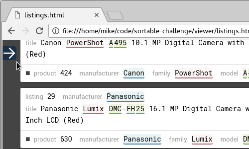
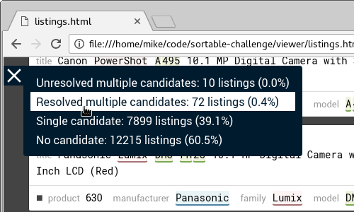

# Sortable challenge

## Requirements

To run the software in this repository, you must have
[Python 3](https://www.python.org/downloads/) or [PyPy
3](http://pypy.org/download.html) installed on your system. The Python
version number must be 3.2 or higher.

## Default usage

After cloning this repository and entering its top-level directory, run
`matcher.py` with Python 3:

    python3 matcher.py

Or with PyPy 3:

    pypy3 matcher.py

The `matcher.py` script reads input data from a pair of files named
`products.txt` and `listings.txt` in your current working directory. It
writes the results to a file named `results.txt` in your current working
directory.

## Path options

You can specify different file paths with command-line options:
- `-p`, `--products`: path to products (input)
- `-l`, `--listings`: path to listings (input)
- `-r`, `--results`: path to results (output)

The options can be used in any combination and any order.

For example, to match a different set of listings:

    python3 matcher.py -l other_listings.txt

Writing the results to a different output file:

    python3 matcher.py -l more_listings.txt -r more_results.txt

Using all three options, this time with PyPy:

    pypy3 matcher.py -p cameras.txt -l ~/big/listings.txt -r ~/big/results.txt

To get a summary of the command-line options, use the `-h` option:

    pypy3 matcher.py -h

## Viewer option

You may be interested in the web-based listing viewer that I made to
help with manual inspection of match candidates.

The `-w` or `--webviewer` option makes `matcher.py` write an HTML file to
`viewer/listings.html` in the directory that contains `matcher.py`. Unlike
the file paths discussed earlier, the HTML file's path is independent
of your current working directory. To work correctly, the HTML file must
be written to the `viewer/` directory supplied with the repository.

The `-w` option takes no argument. It can be used in conjunction with
the other path options.

For example, to generate a web viewer using the default input and
output paths:

    python3 -w

Using different listings, this time with PyPy:

    pypy3 -w -l ~/big/listings.txt

Changing the order of the options:

    pypy3 -l ~/big/listings.txt -w

After running `matcher.py` with the `-w` option, you can open
`viewer/listings.html` in a web browser to view the listings and their
match candidates. If there are tens of thousands of items, the page will
take several seconds to load.

The listings are grouped by number of candidates and resolution
status. You can jump to the start of each group using the menu in the
upper left corner:

